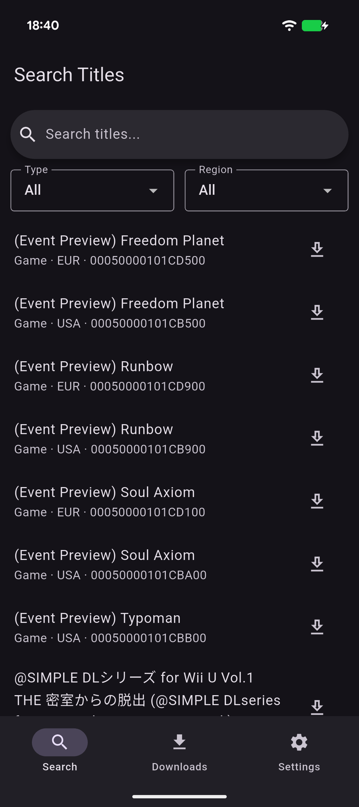
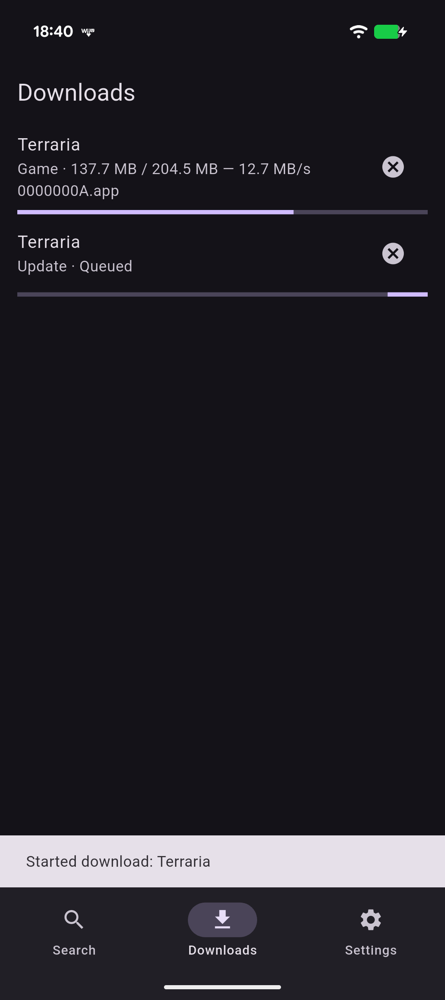
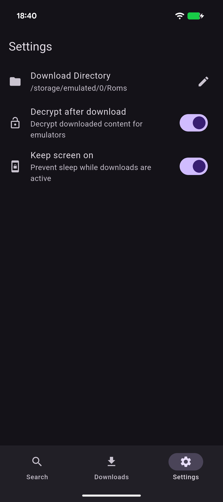

# Wii U Downloader Android

Port of [WiiUDownloader](https://github.com/Xpl0itU/WiiUDownloader.git) to Android using flutter.

### Features:
- Download Wii U titles from official Nintendo servers and decrypt them optionally
- Download in the background
- Option to keep the screen alive while downloading so the device cannot go into sleep mode and interrupt the download

### Screenshots:

  
  
  

